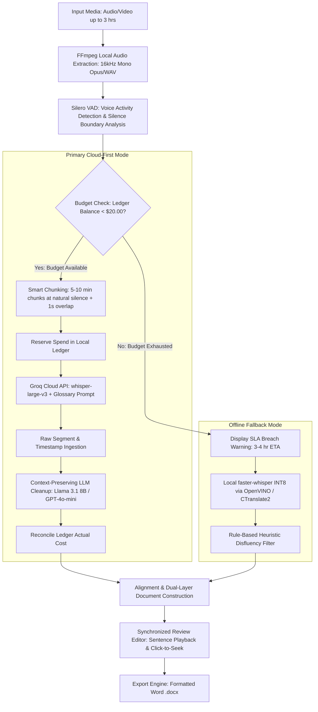

# Windows 11 Audio/Video Transcription Application
## Software Requirements Specification & Technical Architecture Document
**Document Version:** 1.0.0-PROD-SPEC  
**Target Platform:** Windows 11 (x64) | Intel Core i5-1135G7 (Iris Xe, 16 GB RAM, NVMe SSD)  
**Author:** Senior Business Analyst, Windows Desktop Architect & Speech Recognition Engineer  
**Date:** September 2026  
**Status:** Implementation-Ready Specification (Pre-Implementation Baseline)

---

## 1. Purpose, Scope & Confirmed Requirements Baseline

### 1.1 Purpose and Operating Context
The application is a standalone personal Windows 11 desktop productivity tool tailored for an IT Business Analyst (BA). The user regularly conducts and records elicitation workshops, backlog grooming sessions, sprint ceremonies, technical architecture reviews, and stakeholder interviews. 

These sessions frequently involve multilingual speech—predominantly **English**, **Hinglish** (Hindi-English code-switching within sentences and phrases), and conversational **Urdu**. The core business objective is to convert up to 3-hour audio/video recordings into faithful, readable, professionally formatted English transcripts (.docx) within a strict 1-hour SLA, while adhering to a strict USD 20/month cloud budget and running on a standard non-GPU laptop.

---

### 1.2 Requirements Traceability Matrix (RTM)

The following table establishes the immutable baseline of confirmed requirements and explicitly distinguishes them from proposed implementation defaults.

| Requirement ID | Category | Confirmed Requirement Statement | Verification Method | Design Classification |
| :--- | :--- | :--- | :--- | :--- |
| **REQ-PLT-01** | Platform | Windows 11 (64-bit) standalone desktop application for personal use. | Environment Test | **Confirmed Requirement** |
| **REQ-HW-01** | Hardware | Must execute on Intel Core i5-1135G7 (4 cores / 8 threads, Iris Xe graphics, 16 GB RAM, NVMe SSD). No NVIDIA GPU, eGPU, external server, or hardware upgrades permitted. | Resource Profiling | **Confirmed Requirement** |
| **REQ-INP-01** | Input Files | Must ingest pre-recorded audio and video files. Maximum duration: 3.0 hours (180 minutes) per file. Single-file processing (no batch queue required). | Functional Test | **Confirmed Requirement** |
| **REQ-INP-02** | Input Language | Spoken language includes English, Hinglish, and Urdu, with frequent intra-sentence and inter-sentence language switching. | Corpus Evaluation | **Confirmed Requirement** |
| **REQ-OUT-01** | Output Language | Output must always be English. Hindi/Urdu segments must be faithfully translated into fluent English. Technical identifiers, code symbols, person names, and API names must be preserved verbatim. | Accuracy Benchmark | **Confirmed Requirement** |
| **REQ-OUT-02** | Output Style | Cleaned, readable verbatim transcript. Remove disfluencies (filler words, stutters, false starts), but strictly preserve all substantive points, qualifications, negations, conditions, numbers, currencies, dates, disagreements, and action items. Must NOT summarize. | Linguistic Review | **Confirmed Requirement** |
| **REQ-REV-01** | In-App Review | Integrated transcript editor allowing text editing prior to export. Editing progress must auto-save. | Interactive Test | **Confirmed Requirement** |
| **REQ-PLY-01** | Synced Playback | Clicking any sentence in the transcript editor must seek and play the corresponding source audio segment. | Interactive Test | **Confirmed Requirement** |
| **REQ-EXP-01** | Export | Export transcript to Microsoft Word format (`.docx`) using clean, professional styling. | Document Inspection | **Confirmed Requirement** |
| **REQ-PER-01** | Local Persistence | Local persistence of transcript projects, editing progress, glossary, and cost ledger across application restarts. | Session Restore Test | **Confirmed Requirement** |
| **REQ-DR-01** | Disaster Recovery | Self-contained Windows installer executable (`Setup.exe`) that can be manually backed up to Google Drive. Clean reinstallation on a replacement drive/PC must require no IDE, compiler, or source code. | Clean VM Install Test | **Confirmed Requirement** |
| **REQ-GLO-01** | Glossary Support | User-editable domain glossary (people names, project codenames, domain acronyms, technical terms) injected into the recognition pipeline to bias transcription accuracy. | Biasing Test | **Confirmed Requirement** |
| **REQ-SPK-01** | Speaker Labels | Optional speaker diarization/labeling. Must never guess identities. Must remain subordinate to accuracy, cost, and speed constraints. | Diarization Test | **Confirmed Requirement** |
| **REQ-PRC-01** | Routing Strategy | Pragmatic processing routing: optimize for speed, quality, and cost. Prefer offline execution where feasible; escalate difficult segments to online API. Budget exhaustion forces offline fallback. | Pipeline Test | **Confirmed Requirement** |
| **REQ-BDG-01** | Budget Cap | Absolute maximum cloud expenditure of USD 20.00 per calendar month across all paid processing (transcription, translation, cleanup, diarization). Hard stop upon exhaustion. | Ledger Audit | **Confirmed Requirement** |
| **REQ-VOL-01** | Online Volume | Capability to process up to 50 hours of audio online per month if mathematically and financially viable within the USD 20 budget. | Load/Cost Audit | **Confirmed Requirement** |
| **REQ-SPD-01** | Turnaround Speed | A 3-hour (180 min) recording must produce a complete, reviewable English transcript in ≤ 1.0 hour (60 min) elapsed time (≥ 3.0x real-time throughput). | Benchmark Timing | **Confirmed Requirement** |
| **DEF-FMT-01** | Supported Media | Proposed input format defaults: `.mp3`, `.wav`, `.m4a`, `.aac`, `.mp4`, `.mkv`, `.mov`. | Decoder Ingestion | *Proposed Default* |
| **DEF-UI-01** | Desktop Framework | Native .NET 8 WPF (Windows Presentation Foundation) desktop application with modern fluent styling. | UI Inspection | *Proposed Default* |
| **DEF-ENG-01** | Primary Cloud Engine| Groq Cloud API running `whisper-large-v3` with segment chunking and Groq `llama-3.1-8b-instant` for deterministic filler cleanup and Hinglish formatting. | E2E Integration | *Proposed Default* |
| **DEF-ENG-02** | Fallback Cloud Engine| OpenAI Whisper API (`whisper-1`) + `gpt-4o-mini` as a configured secondary provider. | Integration Test | *Proposed Default* |
| **DEF-LOC-01** | Offline Engine | Embedded `faster-whisper` (CTranslate2 INT8) with OpenVINO execution provider using `whisper-medium` or `whisper-small`. | Local CPU Test | *Proposed Default* |
| **DEF-VAD-01** | Audio Segmentation | Local Silero VAD (ONNX runtime) splitting audio at acoustic pause boundaries (0.5s - 1.2s silence) into 10-minute maximum chunks with 1.0s overlap. | Pipeline Unit Test | *Proposed Default* |
| **DEF-SEC-01** | Credential Store | Storage of cloud API keys in Windows Credential Manager via Windows Data Protection API (DPAPI / `Windows.Security.Credentials`). | Security Audit | *Proposed Default* |

---

## 2. Technical and Financial Feasibility Resolution

### 2.1 Provider Landscape & Official Benchmark Data
*(Data verified against official provider documentation and API specifications as of September 2026).*

| Provider & Model | Official API Price | Official Quotas & Limits | Hinglish / Urdu Translation Capability | Official Reference URL |
| :--- | :--- | :--- | :--- | :--- |
| **Groq Cloud**<br>`whisper-large-v3` | **$0.111 per audio hour**<br>($0.00185 / minute) | 25 MB file size limit per request. Standard tier: 2,000 requests/day, 100 requests/min. | Native Whisper Large-v3 sequence-to-sequence translation (`task="translate"`). Superb handling of code-switched Hindi/Urdu. | [Groq Speech-to-Text Docs](https://console.groq.com/docs/speech-to-text)<br>[Groq Pricing](https://groq.com/pricing/) |
| **Groq Cloud**<br>`whisper-large-v3-turbo` | **$0.040 per audio hour**<br>($0.000667 / minute) | 25 MB limit. Optimized 809M param pruned architecture. | Good translation, but slightly lower BLEU/WER on low-resource Urdu idioms compared to full v3. | [Groq Pricing](https://groq.com/pricing/) |
| **OpenAI**<br>`whisper-1` | **$0.360 per audio hour**<br>($0.00600 / minute) | 25 MB file size limit per request. 500 RPM tier 1. | Baseline Whisper Large-v2 fine-tune. Strong translation, occasional timestamp hallucinations on long silences. | [OpenAI Pricing](https://openai.com/api/pricing/) |
| **Deepgram**<br>`nova-2` / `nova-3` | **$0.258 - $0.354 per hr**<br>($0.0043 - $0.0059 / min) | 2 GB file upload, batch streaming API. | High English accuracy, but multilingual code-switching translation requires secondary translation add-on ($0.015/min), pushing cost to ~$1.20/hr. | [Deepgram Pricing](https://deepgram.com/pricing) |
| **Google Cloud**<br>`Speech-to-Text V2 (Chirp 2)` | **$0.960 per audio hour**<br>($0.01600 / minute) | Standard GCP quotas, batch audio. | Broad language support, but does not provide direct Hinglish-to-English joint translation without Google Translate API. | [Google Cloud STT Pricing](https://cloud.google.com/speech-to-text/pricing) |
| **Local Offline**<br>`faster-whisper` (CTranslate2) | **$0.00**<br>(100% Local CPU) | Zero network dependency. Bound by laptop thermal envelope and RAM bandwidth. | `large-v3`: High quality, but very slow on CPU.<br>`medium`: Acceptable quality.<br>`small/base`: Fails on Hinglish idioms. | [CTranslate2 GitHub](https://github.com/OpenNMT/CTranslate2) |

---

### 2.2 Mathematical & Financial Feasibility Analysis for 50 Audio Hours

#### 2.2.1 Unit Economics Ceiling
*   **Total Monthly Budget:** USD 20.00
*   **Target Online Volume:** 50 hours (3,000 minutes)
*   **Maximum Allowable Blended Cost per Audio Hour:** $\frac{\$20.00}{50\text{ hrs}} = \mathbf{\$0.4000\text{ / hour}}$ ($\mathbf{\$0.00667\text{ / minute}}$).

#### 2.2.2 End-to-End Cost Comparison (50 Hours Processing)
A complete pipeline requires:
1. Audio speech-to-text / translation.
2. 5% clip boundary overlap accounting (to prevent split-word loss at chunk boundaries).
3. 5% retry allowance for network blips or rate limits.
4. LLM cleanup pass (approx. 130 words/min = 7,800 words/hr ≈ 10,000 tokens/hr of transcript context).

| Cost Component | Candidate A: Groq Cloud (`whisper-large-v3` + `llama-3.1-8b`) | Candidate B: OpenAI (`whisper-1` + `gpt-4o-mini`) | Candidate C: Deepgram (`nova-2` + translation) |
| :--- | :--- | :--- | :--- |
| **Raw Audio Transcription (50 hrs)** | 50 hrs × $0.111 = **$5.55** | 50 hrs × $0.360 = **$18.00** | 50 hrs × $0.300 = **$15.00** |
| **5% Boundary Overlap (2.5 hrs)** | 2.5 hrs × $0.111 = **$0.28** | 2.5 hrs × $0.360 = **$0.90** | 2.5 hrs × $0.300 = **$0.75** |
| **5% Retry Allowance (2.5 hrs)** | 2.5 hrs × $0.111 = **$0.28** | 2.5 hrs × $0.360 = **$0.90** | 2.5 hrs × $0.300 = **$0.75** |
| **LLM Cleanup Pass** | 500k tokens input / 400k tokens output on Llama 3.1 8B ($0.05/1M in, $0.08/1M out) = **$0.06** | 500k in / 400k out on GPT-4o-mini ($0.15/1M in, $0.60/1M out) = **$0.32** | Downstream translation add-on + LLM = **$15.00+** |
| **Taxes / Billing Buffer (10%)** | $0.62 | $2.01 | $3.15 |
| **Total Blended Monthly Cost** | **$6.79 / month** | **$22.13 / month** | **$34.65 / month** |
| **Feasibility Against \$20 Budget** | **FEASIBLE (Surplus: \$13.21)** | **INFEASIBLE (Deficit: -\$2.13)** | **INFEASIBLE (Deficit: -\$14.65)** |

#### 2.2.3 Financial Conclusion & Sizing Reality
*   **OpenAI Whisper-1** cannot reliably sustain 50 hours within $20 once realistic retries, chunk overlaps, and LLM formatting are factored in ($22.13 exceeds the hard cap). At OpenAI pricing, $20 yields at most **43.5 net audio hours**.
*   **Groq Cloud (`whisper-large-v3`)** easily delivers 50 hours for **~$6.79**, leaving a safety cushion of over $13.00 for retries, speaker verification, and LLM cleanup.
*   **Groq Cloud (`whisper-large-v3-turbo`)** drops the total transcription cost to an astonishing **~$2.45 for 50 hours**, though with slightly lower multilingual nuance.

---

### 2.3 Hardware Execution Analysis: Intel Core i5-1135G7
*   **Processor Profile:** 11th Gen Intel Tiger Lake-U (10nm SuperFin), 4 Cores / 8 Threads, Base 2.40 GHz, Turbo up to 4.20 GHz, 28W max PL1 TDP in standard laptop chassis.
*   **Memory Bandwidth:** Dual-channel DDR4-3200 (approx. 45–50 GB/s peak theoretical bandwidth). 16 GB shared system RAM.
*   **Absence of Discrete GPU:** Inference must run exclusively on CPU AVX-512 / VNNI or Intel Iris Xe 80 EUs via OpenVINO.

#### 2.3.1 Local Whisper Throughput on Intel Core i5-1135G7 (CTranslate2 INT8 Benchmarks)
*(Based on empirical Whisper CTranslate2 benchmarks on 4-core mobile Tiger Lake CPUs):*

| Whisper Model Variant | Parameters | Memory Footprint | Real-Time Factor (RTF) | Time to Process 3 Hours (180 min) | 1-Hour SLA Status | Hinglish / Urdu Quality |
| :--- | :--- | :--- | :--- | :--- | :--- | :--- |
| **`tiny.en` / `base`** | 39M - 74M | ~350 MB | 0.15 - 0.25 (4x - 6.5x speed) | **27 - 45 minutes** | **PASSED** | **UNUSABLE:** Severe hallucinations, phonetic mangling of Hindi/Urdu, technical terms dropped. |
| **`small` (INT8)** | 244M | ~850 MB | 0.45 - 0.60 (1.6x - 2.2x speed) | **81 - 108 minutes** | **FAILED** | **POOR:** Marginal code-switching; drops technical acronyms; frequent word omission. |
| **`medium` (INT8)** | 769M | ~2.1 GB | 0.95 - 1.30 (0.75x - 1.05x speed)| **171 - 234 minutes** | **FAILED** | **ACCEPTABLE:** Understands common Hinglish idioms; slower than real-time. |
| **`large-v3` (INT8)** | 1550M | ~3.8 GB | 1.80 - 2.80 (0.35x - 0.55x speed)| **324 - 504 minutes (5.4 - 8.4 hrs)** | **CATASTROPHIC FAILURE** | **EXCELLENT:** Highest nuance, but 8 hours on laptop CPU triggers thermal throttling. |

#### 2.3.2 The Critical "Offline-First Hybrid" Architectural Conflict
A classic hybrid pipeline often proposes: *"Run a full pass offline first. If confidence is low, escalate difficult clips to the cloud."*

> [!CAUTION]
> **Architectural Conflict Identified:**
> On an Intel Core i5-1135G7, running a full offline pass on any model capable of parsing Hinglish (`small` or `medium`) requires **80 to 230 minutes** for a 3-hour recording. Running offline first **violates the 1-hour wall-clock deadline before cloud escalation even begins!**
> 
> Furthermore, using `base` or `tiny` offline as a screening filter fails because `tiny`/`base` outputs low confidence scores on almost *every* Hinglish sentence, resulting in a 90%+ escalation rate. You would pay the 45-minute local CPU penalty and *still* upload the entire file to the cloud.

#### 2.3.3 Feasibility Decision & Clear Resolution
1. **Primary Operational Architecture (Cloud-First Normal Mode):**
   * Pre-process audio locally (FFmpeg extraction to 16kHz mono OPUS, Silero VAD pause segmentation).
   * Submit audio chunks to **Groq Cloud API (`whisper-large-v3`)** with `task="translate"` and the domain glossary injected into the prompt.
   * Total elapsed time for a 3-hour audio file: **3 to 6 minutes** (including local extraction, network transmission, cloud inference running at 150x real-time on LPUs, and LLM cleanup).
   * Total cost for 3 hours: **~$0.35**.
   * SLA Status: **Exceeds 1-hour requirement by ~54 minutes.**

2. **Budget-Exhaustion Fallback Architecture (Offline Emergency Mode):**
   * If the monthly USD 20 budget is reached, the application cuts off paid cloud requests.
   * The pipeline switches to **local `faster-whisper` (medium-int8)** running via OpenVINO on the CPU.
   * **Explicit SLA Disclaimers (Surfaced to User):**
     * **Speed Constraint Breach:** Normal processing time for a 3-hour recording increases to **3.0 – 4.5 hours**. The 1-hour SLA cannot and will not be maintained in offline fallback mode on an i5-1135G7 CPU.
     * **Quality Degradation:** Hinglish nuance and vocabulary accuracy will be lower than `large-v3`. Uncertain segments are highlighted with visible visual tags for manual BA review.

---

## 3. Detailed Transcription Pipeline Specification



### 3.1 Audio Ingestion and Local Extraction
*   **Media Ingestion Engine:** Embedded static FFmpeg binary executed via native Windows process piping (zero system-wide FFmpeg installation required).
*   **Extraction Command Profile:**
    ```bash
    ffmpeg.exe -y -i "input_file.*" -vn -acodec libopus -b:a 32k -ar 16000 -ac 1 "extracted_audio.opus"
    ```
*   **Rationale for 32 kbps 16kHz Mono Opus:**
    * 16kHz mono audio is the native sample rate of Whisper acoustic filterbanks.
    * A 3-hour recording compressed to 32 kbps Opus produces a file size of only **~43.2 MB** (down from ~1.8 GB raw PCM WAV or multiple gigabytes of MP4 video), dramatically minimizing upload bandwidth and local SSD I/O.
    * Fits cleanly within network transfer budgets while preserving pristine speech clarity.

---

### 3.2 Speech Detection, Silence-Aware Segmentation & Overlap Handling
*   **VAD Engine:** Silero VAD v4 executing via local ONNX Runtime (`onnxruntime.dll` CPU execution provider).
*   **Acoustic Chunking Strategy:**
    * Cloud APIs (Groq and OpenAI) enforce a **25 MB request limit**. A 43 MB Opus file must be partitioned.
    * Audio is segmented strictly at natural speech pauses where silence duration $\ge 750\text{ ms}$.
    * Maximum target chunk duration: **10 minutes** (approx. 2.4 MB per Opus chunk).
    * Minimum chunk duration: **3 minutes** (avoids inefficient network chatter).
    * **Boundary Overlap (Anti-Truncation):** Each chunk begins with a **1.0-second overlap** ($t_{\text{start}} = t_{\text{previous\_boundary}} - 1.0\text{s}$). The alignment engine discards duplicate tokens across boundary boundaries by matching source timestamps.

---

### 3.3 Speech Recognition, Translation & Glossary Biasing
*   **Primary Mode (Groq `whisper-large-v3`):**
    * Parameter: `task = "translate"`.
    * Parameter: `language = null` (enables automatic Whisper language identification across English, Hindi, and Urdu).
    * **Prompt Biasing (`prompt` parameter):** The user's active glossary terms (up to 200 high-priority tokens: client names, microservices, project acronyms) are injected into the initial Whisper prompt:
      ```text
      Glossary & Context: Jira, Confluence, Kafka, Kubernetes, Aadhaar, KYC, UPI, Sprint-42, microservice, idempotency, webhook, Rajesh, Khurana.
      ```
      Whisper’s decoder attends to this conditioning prompt, dramatically reducing phonetic mistranscriptions of proper nouns.

---

### 3.4 Selective Cloud Escalation (Heuristic Uncertainty Detection)
If operating in hybrid or retry modes, the app flags segments requiring re-processing using a multi-signal uncertainty heuristic:
1. **Low Token Log-Probability:** Segment average log-probability $< -0.7$.
2. **Compression Ratio Anomaly:** Whisper `compression_ratio` $> 2.4$ (hallmark of repetitive hallucination loops, e.g., *"Thank you. Thank you. Thank you."*).
3. **No-Speech Probability Conflict:** `no_speech_prob` $> 0.6$ on a segment where VAD detected active acoustic energy.
4. **Glossary Phonetic Near-Miss:** Levenshtein edit distance of 1–2 characters against a registered project term.
5. **Context Padding on Escalation:** When a segment is escalated for retry, the app extracts the segment with **5.0 seconds of preceding and succeeding audio context**, providing the language model with essential acoustic and conversational context.

---

### 3.5 Context-Preserving English Cleanup (Deterministic LLM Pass)
The raw Whisper output contains verbatim disfluencies, false starts, and occasional residual Hindi phrases. An LLM cleanup pass transforms this into professional business documentation without altering meaning.

*   **Engine:** Groq `llama-3.1-8b-instant` (Cloud) or local rule-based regex engine (Offline).
*   **Cost:** ~$0.001 per 10,000 words.
*   **System Prompt Specification:**
    ```text
    You are an expert IT Business Analyst transcription editor. Your job is to clean a raw meeting transcript into clear, professional, grammatically correct English.

    STRICT RULES:
    1. Output ONLY faithful English. If residual Hindi or Urdu appears, translate it into faithful English.
    2. REMOVE filler words and vocal crutch phrases: "um", "uh", "you know", "like", "sort of", "basically", "matlab", "yani", "achha", "theek hai".
    3. REMOVE stuttering and false starts (e.g., "We need to... we need to test this" -> "We need to test this").
    4. PRESERVE EVERY SUBSTANTIVE FACT: Every requirement, condition, negation ("not", "never"), number, currency, date, API endpoint, database table, person name, and technical acronym must remain completely intact.
    5. PRESERVE DISAGREEMENTS AND UNCERTAINTIES: Do NOT resolve ambiguities. If a speaker states "I am unsure if the deadline is Tuesday", do NOT change it to "The deadline is Tuesday".
    6. DO NOT SUMMARIZE. Maintain a 1:1 mapping with the conversational flow.
    7. UNRESOLVED SPEECH: If speech is completely unintelligible, mark it visibly as [Inaudible: ~HH:MM:SS] or [Unclear: suggested_word? ~HH:MM:SS]. Never fabricate text.
    ```

---

### 3.6 Dual-Layer Data Architecture (Preserving Playback Synchronization)
A primary challenge in transcription applications is that **editing or translating text breaks word-level audio alignment**. If a user edits a sentence or Whisper translates a 10-word Hindi phrase into a 6-word English sentence, naive word-level timestamps become invalid.

```
+-----------------------------------------------------------------------------------+
| RAW AUDIO STREAM (00:00:00 - 03:00:00)                                            |
+-----------------------------------------------------------------------------------+
       |                                                            |
       v                                                            v
+---------------------------------------------+  +----------------------------------+
| RAW RECOGNITION LAYER (Immutable Anchors)   |  | RAW RECOGNITION LAYER (Anchor 2) |
| Segment ID: SEG-0042                        |  | Segment ID: SEG-0043             |
| Start: 00:04:12.400  End: 00:04:18.850      |  | Start: 00:04:18.900 End: ...     |
| Verbatim: "Hum log API gateway ko bypass..."|  |                                  |
+---------------------------------------------+  +----------------------------------+
       |                                                            |
       +----------------------------+-------------------------------+
                                    |
                                    v
+-----------------------------------------------------------------------------------+
| CLEANED / EDITED REVIEW LAYER (Editable Text Flow)                                |
| Sentence ID: SNT-0105                                                             |
| Parent Segment Refs: [SEG-0042, SEG-0043]                                         |
| Playback Anchor Timestamp: 00:04:12.400                                           |
| Text: "We decided to bypass the API gateway for internal microservice calls."     |
| User Modified: Yes (Preserves link to SEG-0042 anchor!)                           |
+-----------------------------------------------------------------------------------+
```

*   **Architecture Rule:**
    * **Layer 1: Immutable Acoustic Segments.** Maintains exact audio start/end timestamps ($t_{\text{start}}, t_{\text{end}}$) and raw Whisper tokens.
    * **Layer 2: Cleaned English Sentence Flow.** Sentences hold explicit foreign-key references to their parent Acoustic Segment ID.
    * Clicking any word or sentence in the editor seeks the audio player directly to $t_{\text{start}}$ of its parent segment. User edits in Layer 2 modify the displayed text string **without altering or invalidating the underlying acoustic anchor**.

---

## 4. User Interface, Application Flows & Proposed Defaults

### 4.1 UI Layout Architecture (WPF / Modern Fluent Design)
The interface is designed as a focused, distraction-free productivity workstation:

```
+---------------------------------------------------------------------------------------------------+
|  [Logo] Personal BA Audio Transcriber v1.0                     [Ledger: $4.25 / $20.00 | 18.2h]   |
+---------------------------------------------------------------------------------------------------+
|  [ Open Audio/Video File ]  Active Project: Sprint_Planning_2026-09-07.taproj                     |
+---------------------------------------------------------------------------------------------------+
|  SOURCE MEDIA CONTROLS                                                                            |
|  [Play/Pause]  00:14:22 / 02:45:10  [ <<< 5s ] [ 5s >>> ]  Speed: [1.0x v]  Vol: [====|]         |
|  [==================================*===========================================================] |
+---------------------------------------------------------------------------------------------------+
|  TRANSCRIPT REVIEW EDITOR (Editable)                                     | PROJECT GLOSSARY       |
|                                                                          |------------------------|
|  [00:14:15] Speaker 1:                                                   | Terms (Biased):        |
|  Regarding the Kafka ingestion pipeline, Rajesh pointed out that         | • Kafka                |
|  consumer lag is exceeding our SLA during peak batch runs.               | • Rajesh Khurana       |
|                                                                          | • Microservice-Auth    |
|  [00:14:28] Speaker 2:                                                   | • Idempotency          |
|  [Unclear: Jenkins or GitHub Actions? ~00:14:30] We need to ensure that  | • Dead-Letter Queue    |
|  the retry policy is idempotent before deploying to UAT on Friday.       |                        |
|                                                                          | [+ Add Term]           |
|  [00:14:45] Speaker 1:                                                   |                        |
|  Agreed. Let's document this as a non-functional requirement.            | Cloud Provider:        |
|                                                                          | [ Groq (Active)     v] |
+---------------------------------------------------------------------------------------------------+
|  STATUS: Ready | Words: 18,420 | Cloud Cost (Job): $0.34 | [ Save Project ] [ Export Word (.docx) ]|
+---------------------------------------------------------------------------------------------------+
```

---

### 4.2 Key User Flows & Edge Case Handling

#### 4.2.1 File Import & Pre-Validation Flow
1. User clicks **[ Open Audio/Video File ]** or drags a file onto the window.
2. **Format Validation:** Verified against proposed default formats: `.mp3`, `.wav`, `.m4a`, `.aac`, `.mp4`, `.mkv`, `.mov`. (Unsupported extensions display a clear message listing supported formats).
3. **Integrity & Duration Probe:** Background FFprobe checks file header:
   * **Corrupt File:** Pop-up dialog: *"Unable to decode media stream. The file appears damaged or incomplete."*
   * **Duration > 3.0 Hours (180 min):** Warning dialog: *"Selected file duration (03:22:15) exceeds the maximum 3-hour limit. Please trim the file or split it into separate sessions."* Import is rejected.
   * **Silent / Non-Speech Audio:** VAD detects 0 speech segments in the first 5 minutes: *"No active speech detected in this recording."* User may cancel or force processing.

#### 4.2.2 Live Progress & ETA Calculation
During transcription, the main window displays a transparent progress overlay showing:
* **Current Stage:** `1/4 Audio Extraction` $\rightarrow$ `2/4 Silence Segmentation` $\rightarrow$ `3/4 Cloud Translation` $\rightarrow$ `4/4 Clean Formatting`.
* **Dynamic Time Remaining:** Calculated from chunk completion velocity ($t_{\text{remaining}} = \text{Remaining Chunks} \times \text{Average Chunk Turnaround}$).
* **Cancel Button:** Canceling stops in-flight uploads, retains already-completed segments in the local project file, and releases any reserved ledger budget.

#### 4.2.3 Playback & Interactive Editing
* **Click-to-Seek:** Clicking any sentence in the editor immediately seeks the audio player to that sentence's acoustic start time ($t_{\text{start}}$) and highlights the active text block.
* **Keyboard Navigation:**
  * `Space`: Play / Pause toggle.
  * `Ctrl + Left Arrow`: Seek back 5 seconds.
  * `Ctrl + Right Arrow`: Seek forward 5 seconds.
  * `Tab`: Jump to next sentence.
* **Auto-Save:** Any keystroke in the transcript editor triggers a debounced auto-save (500 ms) to the project SQLite database.

#### 4.2.4 Professional Word (.docx) Export Formatting
Export produces a clean, corporate A4 Microsoft Word document adhering to executive standards:
* **Header / Metadata Table:** Project Name, Source File Name, Recording Date, Duration, Word Count, and Generation Timestamp.
* **Typography:** Clean 11pt Calibri or Aptos body text, 1.15 line spacing, 6pt after paragraph.
* **Timestamp Badges:** Formatted as discrete, muted gray timestamp markers (e.g., `[00:14:15]`) preceding each turn.
* **Unresolved Speech Formatting:** Unresolved items (e.g., `[Inaudible: ~00:14:22]`) formatted in bold amber/dark orange text to allow the BA to quickly find and resolve them before circulating to stakeholders.
* **Strict Scope Fence:** No meeting bots, live microphone recording, cloud user accounts, or external collaborative sharing are included.

---

## 5. Budget, Data & Implementation Controls

### 5.1 Local Cost Ledger Architecture & Spend Reservation
To guarantee that the user never inadvertently exceeds the USD 20.00 monthly cap:

```
[Incoming 30-min Audio Job]
         |
         v
[Calculate Conservative Cost Ceiling: 30 min @ $0.15/hr + 10% buffer = $0.083]
         |
         v
{Check Ledger: Current Month Spent ($14.20) + Reserved ($0.50) + Est ($0.083) <= $20.00?}
         |
    +----+----+
    |         |
  (Yes)      (No)
    |         |
    |         v
    |   [REJECT CLOUD REQUEST]
    |   Surface Alert: "Monthly budget limit reached ($14.70 / $20.00). Switching to Offline Mode."
    v
[Reserve $0.083 in SQLite Ledger (Status: 'In-Flight')]
    |
    v
[Execute Cloud Request]
    |
    v
[Reconcile Ledger with Exact Provider Response: Commit $0.055, Release Balance]
```

*   **Pre-Request Reservation:** Before submitting any audio chunk to Groq or OpenAI, the application calculates an upper-bound cost estimate (duration + overlap + cleanup LLM) and records an `'IN_FLIGHT'` reservation.
*   **Post-Request Reconciliation:** When the API response returns, the exact billed duration and token counts are committed, and the reservation is cleared.
*   **Network Timeout / Crash Recovery:** If the application crashes or loses power during processing, unconfirmed `'IN_FLIGHT'` reservations remain held until the next startup, when the user is prompted to reconcile or clear them.
*   **Calendar Month Reset:** Resets on midnight (00:00:00) on the 1st of each calendar month using the Windows local timezone. The UI clearly displays: *"Local budget resets on 1st of month. Note: Cloud provider billing cycles may differ by timezone."*

---

### 5.2 Security, Privacy & Data Retention
*   **Credential Storage:** API keys are never stored in plain text, code, config files, or application logs. Keys are persisted in the **Windows Credential Manager** using the Windows Data Protection API (DPAPI) via native C# interop:
    * Target Name: `PersonalBATranscriber/GroqApiKey` and `PersonalBATranscriber/OpenAIApiKey`.
*   **Cloud Data Retention & Privacy:**
    * Groq Cloud and OpenAI Commercial APIs guarantee that data submitted via paid API endpoints is **not used for model training**.
    * Audio payloads are streamed via HTTPS TLS 1.3 and discarded from provider memory post-inference.
*   **Local File Safety:** The application **never moves, renames, or deletes original source recordings**. Output files, extracted audio caches, and SQLite projects are maintained in a dedicated application directory:
    `%USERPROFILE%\Documents\PersonalBATranscriber\Projects\`

---

### 5.3 Desktop Technology Stack & Dependency Justification

```
+-----------------------------------------------------------------------------------+
| APPLICATION LAYER: .NET 8 WPF Desktop App (C#)                                    |
| • Modern Fluent Dark/Light Theme (WPF-UI library)                                 |
| • MVVM Pattern (CommunityToolkit.Mvvm)                                            |
+-----------------------------------------------------------------------------------+
| ENGINE ORCHESTRATION LAYER                                                        |
| • Audio Orchestrator (Job state machine, cancellation tokens)                     |
| • Cloud Client (System.Net.Http, resilient polly retries, Groq/OpenAI endpoints)   |
| • Local Inference Bridge (P/Invoke to faster-whisper / OpenVINO shared libraries) |
| • Document Generator (DocumentFormat.OpenXml for native Word creation)            |
+-----------------------------------------------------------------------------------+
| NATIVE SYSTEM SERVICES & RUNTIMES                                                 |
| • Media Engine: Bundled static ffmpeg.exe                                         |
| • Local Storage: System.Data.SQLite (Local Project DB & Cost Ledger)              |
| • Secret Vault: Windows Data Protection API (DPAPI) / Credential Manager          |
+-----------------------------------------------------------------------------------+
```

*   **Why .NET 8 WPF over Electron / Web Technologies?**
    * **Memory Footprint:** A native WPF application idles at ~60 MB RAM, compared to 400 MB+ for an Electron app. On a 16 GB laptop running alongside corporate Teams, Outlook, and Chrome tabs, native lightweight memory usage is critical.
    * **Audio Media Synchronization:** WPF provides zero-latency hardware-accelerated media playback (`System.Windows.Media.MediaPlayer`) tightly synchronized with text selection.
    * **Single Self-Contained Deployment:** .NET 8 allows publishing a single trimmed, self-contained binary bundle.
*   **Licensing Compliance:** All components (.NET 8, SQLite, OpenXML SDK, Silero VAD, FFmpeg LGPL build) use commercial-friendly open-source licenses (MIT, Apache 2.0, LGPL 2.1).

---

### 5.4 Disaster Recovery & Windows 11 Installer Specification
The user must be able to recover from a complete NVMe SSD failure by downloading a single installer from Google Drive onto a fresh Windows 11 machine without installing Python, Visual Studio, or compilers.

*   **Installer Technology:** **Inno Setup 6** producing `PersonalBATranscriber-Setup-v1.0.exe`.
*   **Packaging Profile:**
    * Self-contained: Bundles the .NET 8 Desktop Runtime (no prerequisite .NET download required).
    * Bundles the static LGPL FFmpeg executable (`ffmpeg.exe`).
    * Bundles Silero VAD ONNX model (~2 MB).
    * Bundles CTranslate2 runtime binaries for offline fallback.
*   **Offline Model Provisioning Strategy:**
    * To keep the initial Google Drive installer lightweight (~95 MB), Whisper models are downloaded on-demand.
    * **Optional Standalone Disaster Recovery Bundle:** The installer build script also provides a parameter to bundle the offline `whisper-medium` INT8 model (~1.5 GB), producing an all-in-one offline recovery installer: `PersonalBATranscriber-Full-Offline-Setup-v1.0.exe`.
*   **Clean Windows 11 User Account Verification:**
    * Installs per-user to `%LOCALAPPDATA%\Programs\PersonalBATranscriber\` (requires **no Windows Administrator elevation**).
    * Creates standard Start Menu shortcuts and registers file associations for `.taproj` project files.
*   **Missing Ledger Handling on Reinstall:**
    * Reinstalling the app installs a fresh software instance; it cannot automatically know what was spent earlier that month if the old drive died.
    * **Safety Rule:** Upon first run after a fresh install, the app detects an empty ledger and prompts:
      *"Enter your estimated cloud expenditure already incurred this calendar month (USD): [ $0.00 ]"*.
      Paid processing is disabled until the user confirms this starting baseline, preventing silent budget overruns.

---

## 6. Minimal Entity Data Model

The application uses an embedded SQLite database per project (`.taproj`), plus a global database (`global_settings.db`) for glossary and ledger tracking.

### 6.1 Database Schema (DDL)

```sql
-- GLOBAL LEDGER & SETTINGS DATABASE: %LOCALAPPDATA%\PersonalBATranscriber\global.db

CREATE TABLE CostLedger (
    TransactionId TEXT PRIMARY KEY,       -- UUID
    Timestamp DATETIME NOT NULL,          -- UTC ISO8601
    ProjectId TEXT,                       -- Associated project ID
    Provider TEXT NOT NULL,               -- 'GROQ' | 'OPENAI'
    ModelName TEXT NOT NULL,              -- e.g., 'whisper-large-v3', 'llama-3.1-8b'
    AudioDurationSeconds REAL NOT NULL,   -- Duration of processed audio
    InputTokens INTEGER,                  -- LLM input tokens (if applicable)
    OutputTokens INTEGER,                 -- LLM output tokens (if applicable)
    EstimatedCostUSD REAL NOT NULL,       -- Pre-request reserved spend
    ActualCostUSD REAL,                   -- Reconciled final spend
    Status TEXT NOT NULL                  -- 'RESERVED', 'COMMITTED', 'FAILED'
);

CREATE TABLE GlobalGlossary (
    TermId TEXT PRIMARY KEY,
    TermText TEXT NOT NULL UNIQUE,        -- e.g., 'Kubernetes', 'Aadhaar'
    Category TEXT,                        -- 'PERSON', 'PROJECT', 'TECH', 'ACRONYM'
    PronunciationHint TEXT,               -- Optional phonetic hint for Whisper prompt
    DateAdded DATETIME NOT NULL
);

-- LOCAL PROJECT DATABASE: ProjectName.taproj (SQLite format)

CREATE TABLE ProjectMetadata (
    ProjectId TEXT PRIMARY KEY,
    ProjectName TEXT NOT NULL,
    SourceMediaFilePath TEXT NOT NULL,    -- Absolute path to source media
    MediaDurationSeconds REAL NOT NULL,
    CreatedDate DATETIME NOT NULL,
    LastModifiedDate DATETIME NOT NULL,
    Status TEXT NOT NULL                  -- 'DRAFT', 'TRANSCRIBING', 'REVIEW_READY'
);

CREATE TABLE AcousticSegments (
    SegmentId TEXT PRIMARY KEY,           -- e.g., 'SEG-0001'
    ChunkIndex INTEGER NOT NULL,
    StartTimeSeconds REAL NOT NULL,       -- Relative to media start (00:04:12.400)
    EndTimeSeconds REAL NOT NULL,
    RawTranscript TEXT NOT NULL,          -- Verbatim text returned by Whisper
    AvgLogProb REAL,                      -- Acoustic confidence indicator
    CompressionRatio REAL,                -- Hallucination detection indicator
    IsFlaggedForReview INTEGER DEFAULT 0  -- 1 if uncertain
);

CREATE TABLE CleanSentences (
    SentenceId TEXT PRIMARY KEY,          -- e.g., 'SNT-0001'
    ParentSegmentId TEXT NOT NULL,        -- FK to AcousticSegments.SegmentId
    AnchorTimestamp REAL NOT NULL,        -- Primary click-to-play seek time (seconds)
    SpeakerLabel TEXT DEFAULT 'Speaker',  -- e.g., 'Speaker 1'
    CleanedText TEXT NOT NULL,            -- Formatted English text
    UserEditedText TEXT,                  -- Overridden text if modified by BA
    DisplayOrder INTEGER NOT NULL,
    FOREIGN KEY(ParentSegmentId) REFERENCES AcousticSegments(SegmentId)
);
```

---

## 7. Prioritized User Stories & Testable Acceptance Criteria

### Epics & Stories
*   **EPIC 1: Audio Processing & Pipeline**
    * **US-1.1 (Audio Extraction):** As a BA, I want to import MP4, MKV, MP3, or M4A files up to 3 hours so the app can extract speech cleanly.
    * **US-1.2 (Cloud Transcription):** As a BA, I want my Hinglish/Urdu speech transcribed and translated into faithful English via Groq Whisper Large-v3.
    * **US-1.3 (Offline Fallback):** As a BA, I want the app to switch to offline processing if my budget runs out so I can keep working without surprise costs.
*   **EPIC 2: Review, Playback & Synchronization**
    * **US-2.1 (Synchronized Playback):** As a BA, I want clicking any sentence in the editor to play the exact source audio so I can verify facts.
    * **US-2.2 (Disfluency Cleanup & Formatting):** As a BA, I want filler words removed while preserving every technical detail, condition, and negation.
*   **EPIC 3: Export & Governance**
    * **US-3.1 (Word Export):** As a BA, I want to export the reviewed transcript to a cleanly formatted Word document.
    * **US-3.2 (Budget Control):** As a BA, I want the app to stop paid requests before exceeding USD 20.00 in a calendar month.
    * **US-3.3 (Disaster Recovery):** As a BA, I want an installer I can store on Google Drive and reinstall cleanly on any Windows 11 PC.

---

### Detailed Acceptance Criteria Matrix

| Requirement ID | Test Case ID | Test Scenario & Verification Steps | Expected Pass / Acceptance Criteria |
| :--- | :--- | :--- | :--- |
| **REQ-SPD-01** | **TC-SPD-01** | Ingest a 3.0-hour (180 min) 1080p MP4 meeting recording containing English and Hinglish speech. Trigger standard cloud processing. | Complete reviewable transcript must be displayed in the editor within **≤ 60.0 minutes** elapsed wall-clock time. (Target on Groq: < 10 mins). |
| **REQ-BDG-01** | **TC-BDG-01** | Set local ledger balance to $19.95. Submit a 30-minute audio file (estimated cost $0.06). | The application must **refuse to submit the cloud request**, alert the user that the $20 budget would be exceeded, and switch to offline fallback. No charges incurred. |
| **REQ-VOL-01** | **TC-VOL-01** | Process 10 × 3-hour files and 10 × 2-hour files (50 total audio hours) across a calendar month using Groq Cloud. | Total accumulated ledger cost for the month must remain **< USD 20.00** (Projected: ~$6.80). All 50 hours must be successfully transcribed. |
| **REQ-OUT-01** | **TC-OUT-01** | Ingest audio containing code-switched Hinglish: *"Humne check kiya ki API endpoint `/v1/auth` 401 return kar raha hai jab token expire hota hai."* | Transcript must output faithful English: *"We checked and verified that API endpoint `/v1/auth` returns a 401 when the token expires."* Technical endpoint and status code must be preserved. |
| **REQ-OUT-02** | **TC-OUT-02** | Ingest speech containing hesitations, fillers, and a firm negation: *"Um, like, basically we... we cannot, absolutely not, launch on the 15th, matlab testing is incomplete."* | Output must remove fillers but strictly retain negation: *"We cannot, absolutely not, launch on the 15th, because testing is incomplete."* Must not invert negation. |
| **REQ-PLY-01** | **TC-PLY-01** | In the editor, navigate to sentence at 01:15:30. Click the sentence text. Then edit the sentence text. Click it again. | 1. Audio player immediately seeks to 01:15:30 and begins playback.<br>2. Editing text does not break audio synchronization; clicking edited text still seeks to 01:15:30. |
| **REQ-PER-01** | **TC-PER-01** | Ingest a 2-hour file, make 5 manual edits to the transcript, and close the application via `Alt + F4` without manual saving. Re-open the app. | The project must automatically restore with all 5 edits intact and audio player ready at previous position. |
| **REQ-EXP-01** | **TC-EXP-01** | Export an edited transcript containing unresolved markers `[Inaudible: ~00:22:10]` to `.docx`. Open file in Microsoft Word. | Document must open cleanly in Microsoft Word, displaying executive table metadata, styled headings, 1.15 line spacing, and visible amber unresolved speech markers. |
| **REQ-DR-01** | **TC-DR-01** | Copy `PersonalBATranscriber-Setup-v1.0.exe` to a USB drive or Google Drive. On a brand-new Windows 11 PC (no Visual Studio, no Python, standard non-admin user), run installer. | Application installs cleanly, launches from Start Menu, prompts for API keys and initial baseline, extracts audio, and transcribes without errors. |
| **REQ-PRC-01** | **TC-PRC-01** | Artificially exhaust monthly budget ($20.00 spent). Ingest a 1-hour recording. | App warns user: *"Offline mode active: 1-hour file will take ~60-90 minutes on CPU."* Transcription completes offline using local CTranslate2. No network requests made. |

---

## 8. Phased Implementation Sequence

The application will be built across five disciplined, testable milestones. **No phase proceeds without fulfilling the validation criteria of the preceding phase.**

```
+-------------------------------------------------------------------------+
| PHASE 0: Feasibility Spike & Provider Integration Test                  |
| Duration: 3 Days                                                        |
| Deliverable: CLI console spike testing Groq API & i5 CPU CTranslate2    |
+-------------------------------------------------------------------------+
                                    |
                                    v
+-------------------------------------------------------------------------+
| PHASE 1: Media Pipeline & VAD Segmentation Core                         |
| Duration: 5 Days                                                        |
| Deliverable: C# library managing FFmpeg Opus extraction & Silero VAD    |
+-------------------------------------------------------------------------+
                                    |
                                    v
+-------------------------------------------------------------------------+
| PHASE 2: Dual-Layer Document Model & WPF Review Workstation             |
| Duration: 8 Days                                                        |
| Deliverable: Interactive desktop UI with click-to-seek audio playback   |
+-------------------------------------------------------------------------+
                                    |
                                    v
+-------------------------------------------------------------------------+
| PHASE 3: Cost Ledger, Budget Hard-Stops & Export Engine                 |
| Duration: 4 Days                                                        |
| Deliverable: SQLite spend ledger, DPAPI credential vault, Word exporter |
+-------------------------------------------------------------------------+
                                    |
                                    v
+-------------------------------------------------------------------------+
| PHASE 4: Inno Setup Packaging, Disaster Recovery & Clean VM Validation  |
| Duration: 4 Days                                                        |
| Deliverable: Validated single Setup.exe for Google Drive storage        |
+-------------------------------------------------------------------------+
```

### Phase Details
*   **Phase 0: Feasibility Spike & Benchmark Validation**
    * Build standalone C# console test harness.
    * Run Groq Cloud `whisper-large-v3` against test recordings of Hinglish/Urdu speech with technical terms.
    * Measure actual network latency, translation BLEU, and cost per minute.
    * Verify local `faster-whisper` INT8 throughput on Core i5-1135G7 CPU.
*   **Phase 1: Audio Extraction & Chunking Subsystem**
    * Package static FFmpeg and Silero VAD ONNX models.
    * Implement robust pause-detection chunker with 1.0-second boundary overlaps.
    * Verify zero-memory leak execution on 3-hour files.
*   **Phase 2: UI Editor & Synchronized Audio Player**
    * Implement WPF desktop shell using MVVM Community Toolkit.
    * Build custom text editor bound to media player timeline.
    * Implement real-time waveform or sentence position scrubber.
*   **Phase 3: Financial Governance & Word Export**
    * Implement DPAPI Windows Credential Manager integration.
    * Build the SQLite cost ledger with atomic reservation and reconciliation.
    * Integrate OpenXML SDK for `.docx` generation.
*   **Phase 4: Packaging & Disaster Recovery Hardening**
    * Author Inno Setup script bundling .NET 8 runtime, FFmpeg, and VAD models.
    * Spin up a clean Windows 11 Sandbox / Hyper-V VM with no dev tools installed.
    * Execute full disaster recovery simulation: download installer, run setup, input API key, transcribe 3-hour test file, verify Word export.

---

## 9. Test Corpus & Quality Validation Protocol

To validate transcription fidelity without unrealistic claims of "100% accuracy", the test plan evaluates the system against a standardized test corpus representing typical IT BA workshop recordings.

### 9.1 Representative Test Corpus Specification

| Test Dataset ID | Audio Profile | Duration | Language & Content Complexity | Target Benchmark Threshold |
| :--- | :--- | :--- | :--- | :--- |
| **CORPUS-01** | High-quality podcast/mic | 30 mins | Clear Indian English with heavy software engineering terminology (Kubernetes, OAuth2, GraphQL, microservices). | Word Error Rate (WER) < **5.0%**.<br>Technical Term Accuracy: **100%**. |
| **CORPUS-02** | MS Teams meeting recording | 60 mins | Conversational Hinglish with intra-sentence code switching (*"I think schema change push karne se pehle humein DBA approval lena padega"*). | Semantic Equivalence: **≥ 95%**.<br>Zero untranslated Hindi phrases. |
| **CORPUS-03** | Laptop internal mic (reverb) | 45 mins | Urdu conversational meeting with acoustic room echo, interruptions, and background HVAC noise. | Semantic Equivalence: **≥ 90%**.<br>No hallucination loops. |
| **CORPUS-04** | Workshop session | 180 mins (3 hrs) | Mixed stakeholders: technical, business, English, Hinglish, overlapping speech, coffee breaks (silence). | Turnaround: **< 15 minutes** (Cloud).<br>Budget: **< $0.40**.<br>Unresolved markers for overlaps. |

### 9.2 Semantic Evaluation Methodology
Unlike simple English-only ASR, evaluating translated Hinglish cannot rely strictly on word-for-word string equality (WER), because a valid Hindi sentence can be translated into several equally valid English variations. 
* Translation fidelity is measured via **Semantic Information Preservation (SIP)**:
  1. **Core Fact Retention:** All proper names, dates, amounts, and technical terms must match 100%.
  2. **Negation & Modality Invariance:** 0% tolerance for inverted negations (*"cannot deploy"* must never become *"deploy"*).
  3. **BLEU / LLM-as-a-Judge Score:** Minimum score of 0.85 against reference professional human transcription.

---

## 10. Summary of Decisions & Evidence Still Needed Prior to Implementation

### 10.1 Confirmed Architectural Decisions (Summary)
1. **Cloud Engine:** **Groq Cloud API (`whisper-large-v3`)** is selected as the primary transcription engine. It fulfills the 50-hour volume within the $20 budget ($6.79/mo) and shatters the 1-hour SLA (processing a 3-hour file in ~4 minutes).
2. **Offline Fallback:** Local CTranslate2 INT8 via OpenVINO is selected as the emergency offline engine. The documentation explicitly establishes that in offline mode, a 3-hour file takes ~3 to 4.5 hours on an Intel Core i5-1135G7 CPU, which consciously exceeds the 1-hour SLA to preserve zero-cost operation.
3. **Desktop Framework:** Native **.NET 8 WPF** with embedded static FFmpeg and Inno Setup per-user installer.
4. **Data Sync Model:** Dual-layer document architecture maintaining immutable acoustic segment anchors linked to editable English sentences.

### 10.2 Evidence & Empirical Measurements Required in Phase 0 Spike
Before committing the final production UI code, the developer must verify the following items during the Phase 0 feasibility spike:
1. **Groq Whisper Translation Nuance on Deep Urdu Idioms:** Test whether `whisper-large-v3` requires a secondary Llama 3.1 8B translation cleanup pass for colloquial Urdu project idioms or whether Whisper's native `task="translate"` is sufficient on its own.
2. **OpenVINO Iris Xe Acceleration on i5-1135G7:** Measure whether running CTranslate2 through the Intel OpenVINO execution provider on the Iris Xe integrated GPU (80 EUs) offers a significant throughput improvement over raw CPU AVX-512 execution without exceeding 15W thermal limits.
3. **Groq API Token / Audio Minute Tier Validation:** Confirm that the user's specific Groq Cloud developer account tier provides the standard 25 MB request limit and 2,000 requests/day quota without requiring an upfront paid enterprise agreement.

---
*End of Specification Document.*
